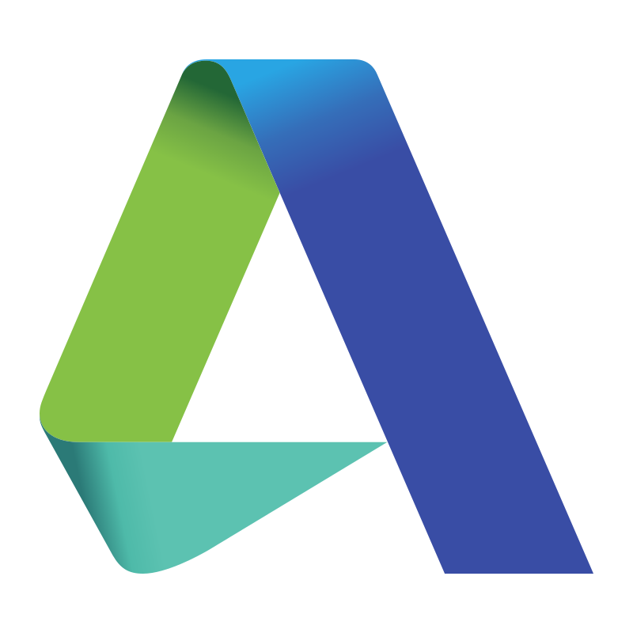

# Kristofer Sell - Software Developer with creative experience

## About me
**Hello!** 

I'm glad you were able to find this place and check out my repository! I'm Kristofer Sell and currently new journey to broaden my horizons in _Software development_. I started with programming back in 2020 with experimenting in console applications in both C# and C++ and later decided to get into _Game Development_. 

**Down below you see both my skills and past experiences.**

---

## Skills

### Development

#### _Development Tools_

### Game Development

#### _Other Tools_

---

##  Professional Experience

### [A Bit Ago Studio](https://abitago.se/)
#### _2023-2024_

- I was working on a project that is currently under non-disclosure agreement.
- Had a divided role at the studio as a Technical Game Designer.

### <a id='internship'>[Blamorama Games](https://blamorama.se/)</a>
#### _01.2023-06.2023_
- Internship part of my education at Futuregames
- I was working on a prototype from scratch of a game that is released, [**_Sliding Into Luleå_**](https://play.google.com/store/apps/details?id=com.blamorama.sliding&hl=sv&pli=1)
- At the time of my internship I was in charge of core mechanics and other smaller mechanics.

---

## Education

### Bachelor's degree in Computer Science (Software Development)

#### [Campus Nyköping](https://www.campusnykoping.se/) _08.2025-Present_

- Ongoing education in Software development with heavy focus in .NET
- Expected graduation to 2027

### Bachelor's degree of Technology and Media

#### [Futuregames](https://futuregames.se) _08.2020-06.2023_

- Voctional Education where I learned the basic of Game development with beginner and intermediate level of coding with C# and the Unity Engine.
- Three projects at the duration of the program with noticable achievements amongst all of them.
- Ended the semester with internship, see 
[**my professional experience**](#internship). 

---

## Lets Connect!
Feel free to connect with me on [_LinkedIn_](https://www.linkedin.com/in/kristofer-sell/) and check out my previous work at my [_Portfolio_](https://elikrisel.github.io/) :shipit:

